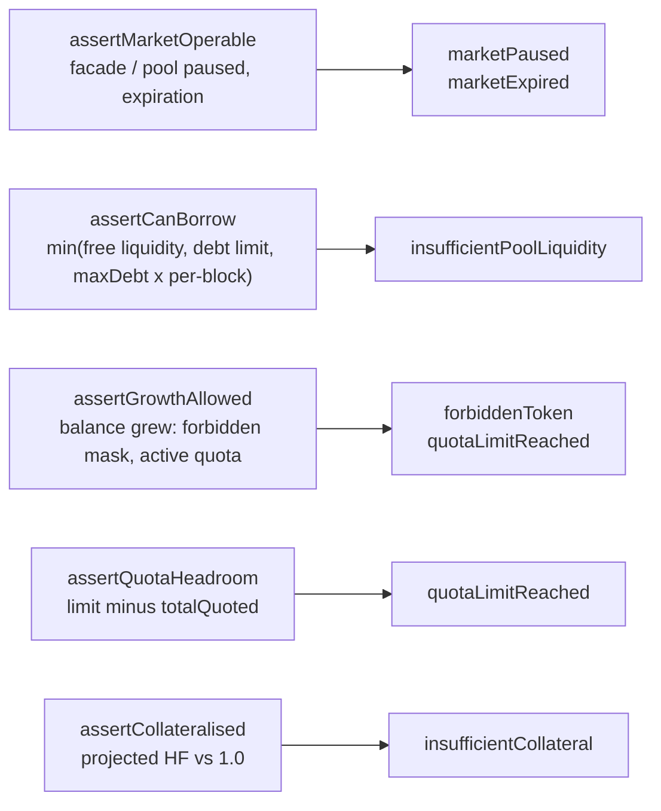
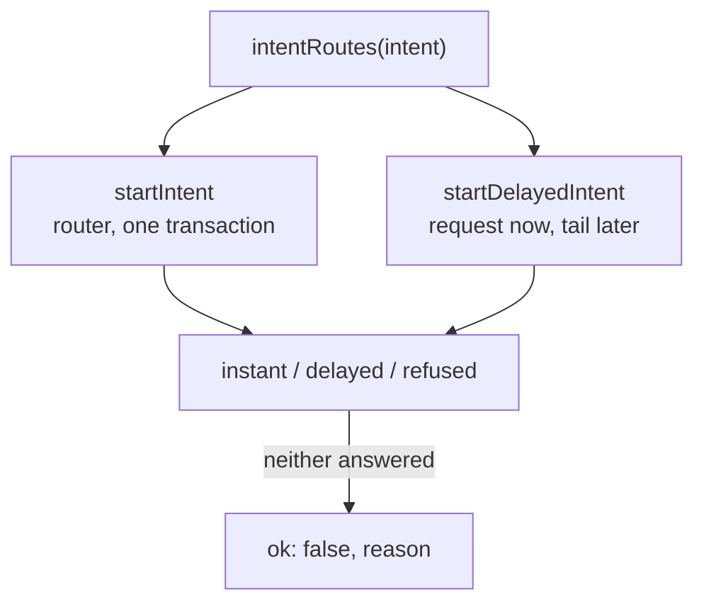

# Intent graphs

Every operation the intent calculator can preview on a credit account, drawn as
a graph: the cases a request splits into, the facade calls each case assembles,
and the arithmetic the amounts come from.

Code: [`src/sdk/accounts/intents`](../../src/sdk/accounts/intents). Public
surface: `sdk.opportunities.prepare` (see
[`src/new-sdk/prepare`](../../src/new-sdk/prepare)).

| Intent            | Public API                     | Planner                  | Debt    | Graph                                     |
| ----------------- | ------------------------------ | ------------------------ | ------- | ----------------------------------------- |
| —                 | `prepare.openNewStrategy`     | `previewOpenStrategy`    | drawn   | [open-strategy.md](./open-strategy.md)     |
| `DEPOSIT`         | `prepare.depositStrategy`     | `planDeposit`            | grows   | [deposit.md](./deposit.md)                 |
| `WITHDRAW`        | `prepare.withdrawStrategy`    | `planWithdraw`           | shrinks | [withdraw.md](./withdraw.md)               |
| `REPAY`           | `prepare.repayStrategy`       | `planRepay`              | shrinks | [repay.md](./repay.md)                     |
| `ADJUST_LEVERAGE` | `prepare.adjustLeverage`      | `planAdjustLeverage`     | changes | [adjust-leverage.md](./adjust-leverage.md) |
| `ADD_COLLATERAL`  | `prepare.addCollateral`       | `planAddCollateral`      | fixed   | [add-collateral.md](./add-collateral.md)   |
| `WITHDRAW_ASSET`  | `prepare.withdrawCollateral`  | `planWithdrawAsset`      | fixed   | [withdraw-asset.md](./withdraw-asset.md)   |
| delayed halves    | the `delayed` branch of the two above, then `prepare.finalize` | `plan*Delayed`, `planFinish*` | varies | [delayed.md](./delayed.md) |

## The pipeline every intent walks

Planning is pure arithmetic on an `AccountView`; realisation is the only half
that talks to the router, the RWA gateways and the withdrawal compressor.

`execute.buildTx` hands the returned `calls` to `executeCaUpdate`, which prepends
on-demand price updates and wraps everything in the facade multicall; nothing in
this folder signs or sends.

## Step vocabulary

A planner emits steps; the realiser turns each into an operation with the
calldata that performs it.

| Step          | Operation                              | Facade / adapter call                                  | Notes                                                                     |
| ------------- | -------------------------------------- | ------------------------------------------------------ | ------------------------------------------------------------------------- |
| `add`         | `addCollateral`                        | `addCollateral` (`…WithPermit` when a permit exists)   | native coin rides along as `value`                                        |
| `borrow`      | `increaseDebt`                         | `increaseDebt(amount)`                                 | guarded by pool liquidity, debt limit, per-block cap                      |
| `repay`       | `decreaseDebt`                         | `decreaseDebt(amount)` or `decreaseDebt(MAX_UINT256)`  | the sentinel whenever the payment covers the whole debt                    |
| `convert`     | `swap` / `wrapRwaCollateral` / `unwrapRwaCollateral` | router path, or the market's RWA gateway   | identity (`from == to`) is dropped, `to` amount is the slippage floor      |
| `closeAll`    | `swap` with many inputs                | router many-to-one path                                | every non-underlying balance in one route; only an exit uses it           |
| `withdraw`    | `withdrawCollateral`                   | `withdrawCollateral(token, amount, to)`                | `all` flag encodes `MAX_UINT256`, i.e. "whatever the balance turns out to be" |
| `sweep`       | `withdrawCollateral` per balance       | same, with the `all` flag                              | RWA wrapper is unwrapped first — it cannot leave the account              |
| `clearQuotas` | `changeQuota`                          | `updateQuota(token, MIN_INT96)` per quoted token        | drops every quota; used by plans that end the loan                        |
| `request`     | `startDelayedWithdrawal`               | compressor-provided request calls                      | the phantom token stands in for the payout until it matures               |
| `claim`       | `claimDelayedWithdrawal`               | compressor-provided claim calls                        | burns the phantom, credits the outputs                                    |

Balances are tracked in a running ledger, so each leg sees what the previous
ones left: a swap only spends what the plan says, a repayment never exceeds the
underlying actually raised, and the closing quota update is sized against the
balances the walk ends on.

## Sentinels

| Value         | Where                                   | Meaning                                                                 |
| ------------- | --------------------------------------- | ----------------------------------------------------------------------- |
| `MAX_UINT256` | `WITHDRAW.amount`                       | take everything: sell the position whole, settle the loan, empty the account |
| `MAX_UINT256` | `REPAY.amount`                          | settle the loan: charge the wallet the debt plus the interest margin      |
| `MAX_UINT256` | `decreaseDebt` with `full: true`        | repay everything outstanding, interest since the quote included          |
| `MAX_UINT256` | `withdrawCollateral`                    | hand over the whole balance, so a swap that beat its floor strands nothing |
| `MIN_INT96`   | `updateQuota`                           | reset the quota rather than name an amount interest may have moved        |

## Math reference

Notation, all in underlying units: `C` collateral (own funds, `TVL − D`), `D`
debt including accrued interest and fees, `L` total leverage scaled by
`LEVERAGE_DECIMALS` (`300n` = 3x), so `TVL = C · L` and `D = C · (L − 1)`.

| Formula                                                | Used by                              | Source                          |
| ------------------------------------------------------ | ------------------------------------ | ------------------------------- |
| `D = C · (L − 1)`                                      | open, adjust leverage, deposit at a target | `debtForLeverage`          |
| `dD = D0 · dC / C0`                                    | deposit and withdraw at fixed leverage | `proportionalDebt`            |
| `W_max`: largest `W` with `floor(D0 · W / C0) ≤ D0 − minDebt`, capped at `C0 − 1` | `maxWithdraw`   | `maxProportionalWithdrawal` |
| `D_settle = D · (1 + 10bps)`                           | `REPAY` with `MAX_UINT256`           | `SETTLE_MARGIN` in `plan.ts`    |
| `debt == 0` or `minDebt ≤ debt ≤ maxDebt`              | every debt move                      | `assertDebtInBand`              |
| `quota = floor(balanceInUnderlying · LT · (1 + reserve))`, rounded down to a `PERCENTAGE_FACTOR` step, increases capped by `2 · maxDebt` minus quota already bought | closing quota update | `calcQuotaUpdate`, `getQuotasForUpdate` |
| `HF = Σ min(quotaᵤ, valueᵤ · LT) / debtᵤ`, balances at or below `DUST_THRESHOLD` ignored, `65535` when there is no debt | the collateral guard | `healthFactor` |
| `A_max`: largest `A` with `HF` at or above `MIN_HF_LIMITED + 2` once `A` of one token leaves — the same `HF` above, at safe prices, solved for that balance | `maxWithdrawCollateral` | `calcMaxWithdrawCollateral` |

Prices come from the market oracle, RWA-aware (a wrapper and its asset convert
1:1 up to decimals). A call that hands funds over is judged at **safe prices** —
the lower of a token's main and reserve feed — because that is what the credit
manager does.

## Guards

Read from the loaded market before anything is signed, so a revert with an
opaque selector becomes a refusal a form can explain.

## Refusal reasons

| Reason                      | Raised when                                                                 |
| --------------------------- | --------------------------------------------------------------------------- |
| `debtOutOfRange`            | the resulting debt would sit outside `[minDebt, maxDebt]` and is not zero    |
| `leverageOutOfRange`        | target below 1x, or a deposit target that would require repaying            |
| `insufficientSourceBalance` | non-positive amount, nothing to sell, net value already eaten by the debt   |
| `unsupportedCollateralToken`| deposit or repayment in a token the flow does not take                      |
| `unsupportedTokenPair`      | the prepare layer finds no pool route for the requested pair                |
| `noDelayedRoute`            | no redemption venue, a leverage move that settles at once, an exit          |
| `multipleDelayedWithdrawals`| several venues for the source and nothing says which                        |
| `withdrawalInProgress`      | a redemption of the asset is already in flight                              |
| `noRecordedIntent`          | a claim naming no operation to resume                                       |
| `marketPaused` / `marketExpired` | the facade takes no multicall at all                                   |
| `insufficientPoolLiquidity` | the pool cannot lend what the plan draws in this block                      |
| `quotaLimitReached`         | no quota left for a token the plan wants to hold, or the token takes none    |
| `forbiddenToken`            | the plan would grow the balance of a forbidden token                        |
| `insufficientCollateral`    | the projected health factor lands below 1.0                                 |

## Two routes for the flows that sell

`WITHDRAW` and `ADJUST_LEVERAGE` sell a position asset, and some assets only
redeem through their issuer — a Securitize dsToken, a Mellow share — which
answers now and pays out days later. `intentRoutes` quotes both from one
request; a route the account cannot take comes back `undefined` with its refusal.

Details and the tails in [delayed.md](./delayed.md).
