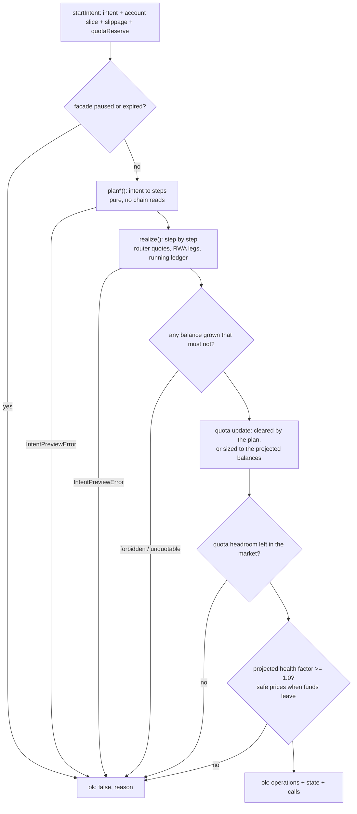
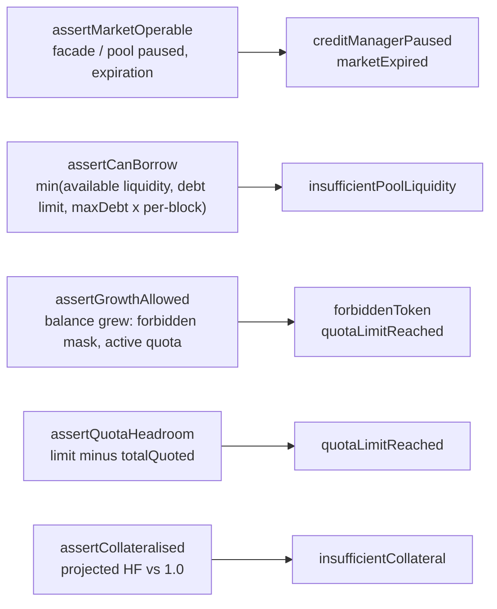
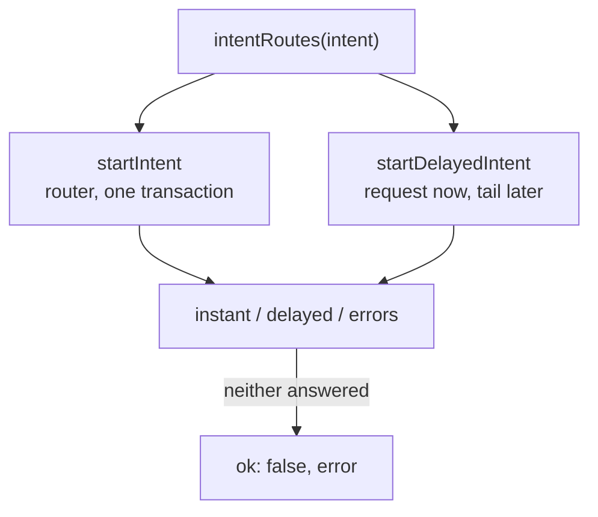

# Intent graphs

Every operation the intent calculator can preview on a credit account, drawn as
a graph: the cases a request splits into, the facade calls each case assembles,
and the arithmetic the amounts come from.

Code: [`src/onchain/accounts/intents`](../../src/onchain/accounts/intents). Public
surface: `sdk.opportunities.prepare` (see
[`src/sdk/prepare`](../../src/sdk/prepare)).

| Intent            | Public API                     | Planner                  | Debt    | Graph                                     |
| ----------------- | ------------------------------ | ------------------------ | ------- | ----------------------------------------- |
| —                 | `prepare.openNewStrategy`     | `buildOpenStrategyState` | drawn   | [open-strategy.md](./open-strategy.md)     |
| `DEPOSIT`         | `prepare.depositStrategy`     | `planDeposit`            | grows   | [deposit.md](./deposit.md)                 |
| `WITHDRAW`        | `prepare.withdrawStrategy`    | `planWithdraw`           | shrinks | [withdraw.md](./withdraw.md)               |
| `REPAY`           | `prepare.repayStrategy`       | `planRepay`              | shrinks | [repay.md](./repay.md)                     |
| `ADJUST_LEVERAGE` | `prepare.adjustLeverage`      | `planAdjustLeverage`     | changes | [adjust-leverage.md](./adjust-leverage.md) |
| `ADD_COLLATERAL`  | `prepare.addCollateral`       | `planAddCollateral`      | fixed   | [add-collateral.md](./add-collateral.md)   |
| `WITHDRAW_ASSET`  | `prepare.withdrawCollateral`  | `planWithdrawAsset`      | fixed   | [withdraw-asset.md](./withdraw-asset.md)   |
| delayed halves    | the `delayed` branch of the two above, then `prepare.finalize` | `plan*Delayed`, `planFinish*` | varies | [delayed.md](./delayed.md) |

## The pipeline every intent walks

Planning is pure arithmetic on an `AccountView`; realisation is the only half
that talks to the router, the RWA gateways and the withdrawal compressor.

`execute.buildTx` hands the returned `calls` to `executeCaUpdate`, which prepends
on-demand price updates and wraps everything in the facade multicall; nothing in
this folder signs or sends.

## Step vocabulary

A planner emits steps; the realiser turns each into an operation with the
calldata that performs it.

| Step          | Operation                              | Facade / adapter call                                  | Notes                                                                     |
| ------------- | -------------------------------------- | ------------------------------------------------------ | ------------------------------------------------------------------------- |
| `add`         | `addCollateral`                        | `addCollateral` (`…WithPermit` when a permit exists)   | native coin rides along as `value`                                        |
| `borrow`      | `increaseDebt`                         | `increaseDebt(amount)`                                 | guarded by pool liquidity, debt limit, per-block cap                      |
| `repay`       | `decreaseDebt`                         | `decreaseDebt(amount)` or `decreaseDebt(MAX_UINT256)`  | the sentinel whenever the payment covers the whole debt                    |
| `convert`     | `swap` / `wrapRwaCollateral` / `unwrapRwaCollateral` | router path, or the market's RWA gateway   | identity (`from == to`) is dropped, `to` amount is the slippage floor      |
| `closeAll`    | `swap` with many inputs                | router many-to-one path                                | every non-underlying balance in one route; only an exit uses it           |
| `withdraw`    | `withdrawCollateral`                   | `withdrawCollateral(token, amount, to)`                | `all` flag encodes `MAX_UINT256`, i.e. "whatever the balance turns out to be" |
| `sweep`       | `withdrawCollateral` per balance       | same, with the `all` flag                              | RWA wrapper is unwrapped first — it cannot leave the account              |
| `clearQuotas` | `changeQuota`                          | `updateQuota(token, MIN_INT96)` per quoted token        | drops every quota; used by plans that end the loan                        |
| `request`     | `startDelayedWithdrawal`               | compressor-provided request calls                      | the phantom token stands in for the payout until it matures               |
| `claim`       | `claimDelayedWithdrawal`               | compressor-provided claim calls                        | burns the phantom, credits the outputs                                    |

Balances are tracked in a running ledger, so each leg sees what the previous
ones left: a swap only spends what the plan says, a repayment never exceeds the
underlying actually raised, and the closing quota update is sized against the
balances the walk ends on.

## Sentinels

| Value         | Where                                   | Meaning                                                                 |
| ------------- | --------------------------------------- | ----------------------------------------------------------------------- |
| `MAX_UINT256` | `WITHDRAW.amount`                       | take everything: sell the position whole, settle the loan, empty the account |
| `MAX_UINT256` | `REPAY.amount`                          | settle the loan: charge the wallet the debt plus the interest margin      |
| `MAX_UINT256` | `decreaseDebt` with `full: true`        | repay everything outstanding, interest since the quote included          |
| `MAX_UINT256` | `withdrawCollateral`                    | hand over the whole balance, so a swap that beat its floor strands nothing |
| `MIN_INT96`   | `updateQuota`                           | reset the quota rather than name an amount interest may have moved        |

## Math reference

Notation, all in underlying units: `C` collateral (own funds, `TVL − D`), `D`
debt including accrued interest and fees, `L` total leverage scaled by
`LEVERAGE_DECIMALS` (`300n` = 3x), so `TVL = C · L` and `D = C · (L − 1)`.

| Formula                                                | Used by                              | Source                          |
| ------------------------------------------------------ | ------------------------------------ | ------------------------------- |
| `D = C · (L − 1)`                                      | open, adjust leverage, deposit at a target | `debtForLeverage`          |
| `dD = D0 · dC / C0`                                    | deposit and withdraw at fixed leverage | `proportionalDebt`            |
| `W_max`: largest `W` with `floor(D0 · W / C0) ≤ D0 − minDebt`, capped at `C0 − 1`, reported beside `C0` itself | `maxWithdraw`   | `maxProportionalWithdrawal` |
| `D_settle = D · (1 + 10bps)`                           | `REPAY` with `MAX_UINT256`           | `SETTLE_MARGIN` in `plan.ts`    |
| `debt == 0` or `minDebt ≤ debt ≤ maxDebt`              | every debt move                      | `assertDebtLimits`              |
| `quota = floor(balanceInUnderlying · LT · (1 + reserve))`, rounded down to a `PERCENTAGE_FACTOR` step, increases capped by `2 · maxDebt` minus quota already bought | closing quota update | `calcQuotaUpdate`, `getQuotasForUpdate` |
| `HF = Σ min(quotaᵤ, valueᵤ · LT) / debtᵤ`, balances at or below `DUST_THRESHOLD` ignored, `65535` when there is no debt | the collateral guard | `healthFactor` |
| `A_max`: largest `A` with `HF` at or above `MIN_HF_LIMITED + 2` once `A` of one token leaves — the same `HF` above, at safe prices, solved for that balance | `maxWithdrawCollateral` | `calcMaxWithdrawCollateral` |

Prices come from the market oracle, RWA-aware (a wrapper and its asset convert
1:1 up to decimals). A call that hands funds over is judged at **safe prices** —
the lower of a token's main and reserve feed — because that is what the credit
manager does. Both factors are reported either way: `healthFactor` at main
prices, `safeHealthFactor` beside it, since which one decides a transaction is a
property of the call that ends up being sent.

The state the walk arrives at is turned into the `OperationState` a caller reads
by `sdk.positions.projection` — the same builder the `preview` module fills its
own results from, so an operation this engine plans and the same operation read
back out of its calldata are described by one piece of code. What it is handed is
taken at its word, which is where the two halves are still allowed to differ:
the engine's ledger keeps wei-level balances and the preview drops anything at or
below `DUST_THRESHOLD`. `previewMatchesPrepare.test.ts` runs a request through
both and holds every field to the other.

## Two amounts per routed leg

The pathfinder answers twice about one swap: what it expects the leg to return,
and the floor it guarantees once slippage is allowed for. Both are used, for
different things, and the walk keeps two ledgers so that neither has to stand in
for the other:

| | Floor | Expected |
| --- | --- | --- |
| The calls, and every amount in them | ✓ | |
| The quota the update buys | ✓ | |
| The guards (`assertCollateralised`) | ✓ | |
| The forbidden-token and quota-need check | | ✓ |
| The reported `OperationState` | | ✓ |

The rule behind the split: anything the transaction promises the facade is
promised on the floor, because that is the only outcome the route is willing to
guarantee — a repayment may not spend underlying a swap has not certainly raised,
and a plan whose floor lands the account under water is refused whatever the
expectation says. Everything reported to the caller follows the expectation,
because that is where the position lands. `openNewStrategy` reports both branches
outright (`averageAssets`/`minAssets`), since `openCA` wants both.

Two consequences worth knowing. The reported balances can carry a surplus the
calls do not spend — a swap that over-delivers against a fixed-amount repayment
leaves the difference on the account, and the projection says so. And the health
factor reported weighs expected balances against the quota actually bought, which
is exactly what the account will stand at if the route delivers what it expects.
`routed-branches.onchain.test.ts` pins both directions by quoting a market whose
floor sits a percent under its expectation.

## Guards

Read from the loaded market before anything is signed, so a revert with an
opaque selector becomes an error a form can explain.

## Error codes

Every error is an `IGearboxError` object: `code` plus the numbers behind it, so
a caller reads the limit that was missed instead of re-deriving it. Anything
with a token and an amount is a `TokenAmount`; optional fields are absent where
the plan stopped before those numbers existed.

The engine's `{ ok: false, error }` half is the same `SDKError` envelope
`prepare` answers with. `error.code` is the discriminant below; the numbers sit
on the error beside it — `error.maxDebt`, `error.token`.

| Code                        | Raised when                                                                 | Fields |
| --------------------------- | --------------------------------------------------------------------------- | ------ |
| `debtOutOfRange`            | the resulting debt would sit outside `[minDebt, maxDebt]` and is not zero    | `requested`, `minDebt`, `maxDebt`, in underlying |
| `leverageOutOfRange`        | target below 1x, or a deposit target that would require repaying            | `requested`, `min`, scaled by `LEVERAGE_DECIMALS` |
| `insufficientBalance`       | non-positive amount, nothing to sell, net value already eaten by the debt   | `required`, `held`, `holderKind` where known |
| `unsupportedCollateralToken`| deposit or repayment in a token the flow does not take                      | `token` |
| `unsupportedTokenPair`      | no pool route for the requested pair, or the pathfinder found no path        | `from`, `to` where the market named one |
| `noDelayedRoute`            | no redemption venue, a leverage move that settles at once, a payout the tail cannot serve | `token` |
| `multipleDelayedWithdrawals`| several venues for the source and nothing says which                        | `token`, `venues` |
| `withdrawalInProgress`      | a redemption of the asset is already in flight                              | `inFlight` |
| `noRecordedIntent`          | a claim naming no operation to resume                                       | — |
| `creditManagerPaused` / `marketExpired` | the facade takes no multicall at all                             | `creditManager`, plus `expirationDate` |
| `insufficientPoolLiquidity` | the pool cannot lend what the plan draws in this block                      | `requested`, `available`, `limit`, in underlying |
| `quotaLimitReached`         | no quota left for a token the plan wants to hold, or the token takes none    | `token`, plus `requested`/`available` **in underlying** — a quota is measured there, not in the token it is held against |
| `forbiddenToken`            | the plan would grow the balance of a forbidden token                        | `token` |
| `insufficientCollateral`    | the projected health factor lands below 1.0                                 | `healthFactor`, `healthFactorThreshold`, `safePrices` |

`insufficientCollateral`'s `healthFactor` is the factor the check compared: safe
prices for a call that hands funds over, main prices otherwise. `safePrices` says
which, so it differing from the projection's `healthFactor` is not a
contradiction — the safe factor is reported there as `safeHealthFactor`.

## Two routes for the flows that sell

`WITHDRAW` and `ADJUST_LEVERAGE` sell a position asset, and some assets only
redeem through their issuer — a Securitize dsToken, a Mellow share — which
answers now and pays out days later. `intentRoutes` quotes both from one
request; a route the account cannot take comes back `undefined` with its error.
The pathfinder reverts rather than answering when it finds no path, and that
revert is read as `unsupportedTokenPair` — otherwise an asset no pool trades
would take the working route down with the one that does not exist.

Details and the tails in [delayed.md](./delayed.md).
