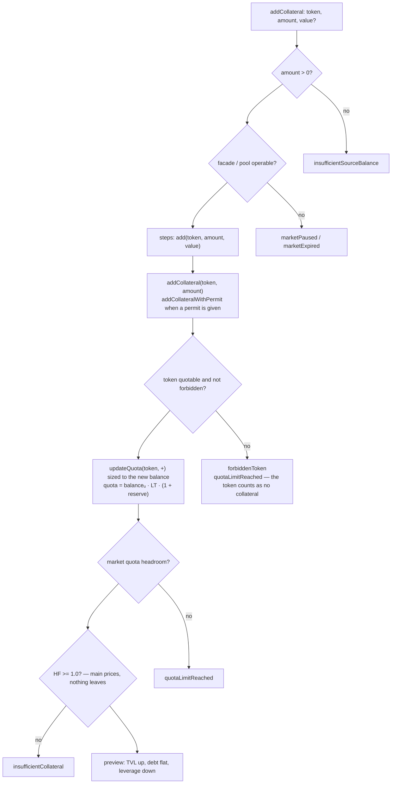
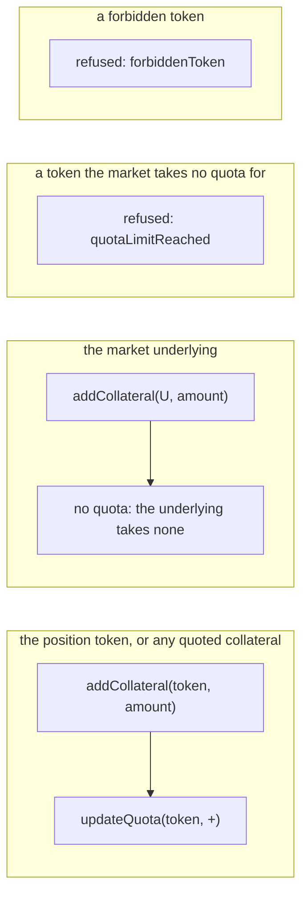

# Add collateral

`prepare.addCollateral` → `startIntent({ type: "ADD_COLLATERAL" })` →
`planAddCollateral` ([`plan.ts`](../../src/onchain/accounts/intents/plan.ts)).

The simplest intent there is: the token lands on the account as it comes and the
debt is untouched. Nothing is routed, nothing is borrowed, so leverage falls —
the same position now stands on more of its own funds.

Use it to top a position up in the token it already holds, or to walk an account
back from a health factor it should not have. For collateral that has to be
levered on the way in, see [deposit](./deposit.md).

## Math

```text
require amount > 0
C1 = C0 + price(token → U, amount)
D1 = D0                              untouched
L1 = TVL1 / C1                       falls, because C grows and D does not
```

## Graph



## Cases



## Notes

- The intent itself accepts any token; what narrows it is the growth guard, which
  refuses a balance the market forbids or cannot count as collateral.
- On an RWA market the raw asset is **not** wrapped here — that is the deposit
  flow. Adding the raw asset leaves it sitting as its own balance.
- `value` rides along for a wrapped-native market paid in the coin.
- Tests: [`add-collateral.onchain.test.ts`](../../src/onchain/accounts/intents/tests/add-collateral.onchain.test.ts).
