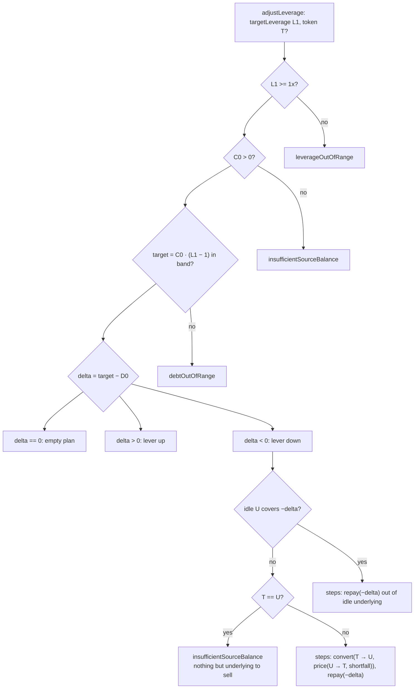

# Adjust leverage

`prepare.adjustLeverage` → `intentRoutes({ type: "ADJUST_LEVERAGE" })` →
`planAdjustLeverage` ([`plan.ts`](../../src/onchain/accounts/intents/plan.ts)).

The collateral stays where it is and the debt is retargeted around it: borrow and
buy to lever up, sell and repay to lever down. Nothing enters or leaves the
account, which is what tells this apart from a deposit or a withdrawal.

Deleveraging can also settle through a redemption instead of the router — the
delayed route in [delayed.md](./delayed.md). Levering up never can: it borrows
and buys, both of which settle at once.

## Math

```text
target = C0 · (L1 − 1) / LEVERAGE_DECIMALS       the debt L1 implies on C0
delta  = target − D0
require L1 >= 1x                                 else leverageOutOfRange
require C0 > 0                                   else insufficientSourceBalance
require target in band                           else debtOutOfRange

delta > 0 : borrow delta, buy delta of T
delta < 0 : idle U pays first; shortfall = −delta − balance(U)
            sell price(U → T, shortfall) of T, repay −delta
delta = 0 : nothing to do
```

## Case selection



`T` defaults to the account's most valuable non-underlying, non-phantom balance.

## Cases and the calls they assemble

```mermaid
flowchart TD
  subgraph a["lever up: delta > 0"]
    a1["increaseDebt(delta)"] --> a2["swap: U → T, delta"] --> a3["updateQuota(T, +) sized to the new balance"]
  end
  subgraph b["lever down, position sold: shortfall > 0"]
    b1["swap: T → U, input priced for the shortfall"] --> b2["decreaseDebt(−delta)"] --> b3["updateQuota(T, −)"]
  end
  subgraph c["lever down out of idle underlying"]
    c1["decreaseDebt(−delta) — the whole plan"] --> c2["no quota move: no balance changed"]
  end
  subgraph d["delta == 0: already at target"]
    d1["no operations, no calls, state reported unchanged"]
  end
  subgraph e["lever down to 1x (L1 = 100n)"]
    e1["swap: T → U for the whole debt"] --> e2["decreaseDebt(MAX_UINT256)<br/>full: the payment covers the whole debt"] --> e3["updateQuota(T, −)"]
  end
```



Deleveraging spends idle underlying before it sells anything — the swap is sized
to the shortfall alone, so an account holding loose `U` from an earlier leg does
not pay routing fees to raise what it already has.

The sell leg keeps the rest of the `T` balance in place: it goes through the
leftover-aware many-to-one path rather than the one-token path, so the router
does not sweep the whole position when only part of it was meant to go.

Levering **down to 1x** ends at zero debt, and the repayment is the whole of it,
so the call carries `MAX_UINT256` to cover the interest still to accrue. Quotas
are **not** dropped: the collateral stays on the account, and it needs its quota
to keep counting as collateral.

## Guards on the way out

| Check                                    | Refusal                        |
| ---------------------------------------- | ------------------------------ |
| pool can lend `delta` (levering up)      | `insufficientPoolLiquidity`    |
| the account holds what the sell leg spends| `insufficientSourceBalance`    |
| `T` quotable and not forbidden           | `quotaLimitReached`, `forbiddenToken` |
| market quota headroom for the increase   | `quotaLimitReached`            |
| HF of the projected state (main prices — nothing leaves) | `insufficientCollateral` |

Levering up is the flow that most often lands on `insufficientCollateral`: the
new debt is counted in full while the bought token counts only under its
liquidation threshold and its quota.

## Notes

- Leverage here is **total** leverage (`TVL / C`, `300n` = 3x); the state the
  preview reports uses the read model's `debt / equity`.
- A `delta == 0` request is answered rather than refused — the account is already
  where it was asked to be, and a form can say so.
- Tests: [`adjust-leverage.onchain.test.ts`](../../src/onchain/accounts/intents/tests/adjust-leverage.onchain.test.ts),
  [`intent-routes.onchain.test.ts`](../../src/onchain/accounts/intents/tests/intent-routes.onchain.test.ts).
