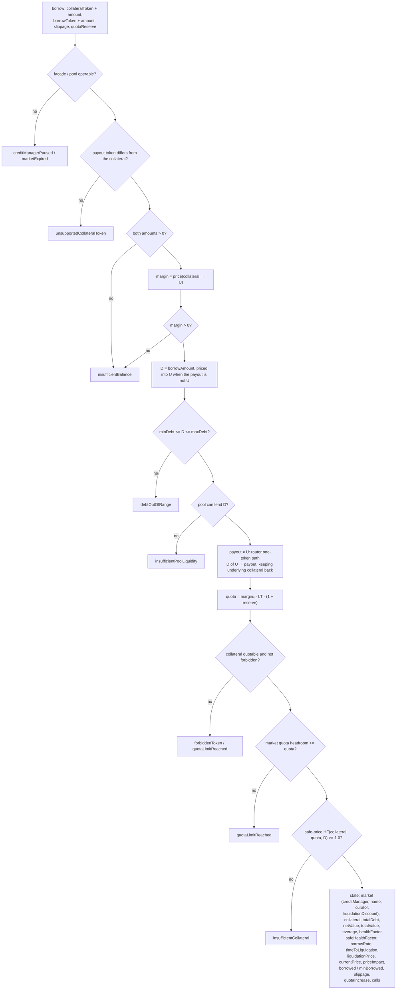
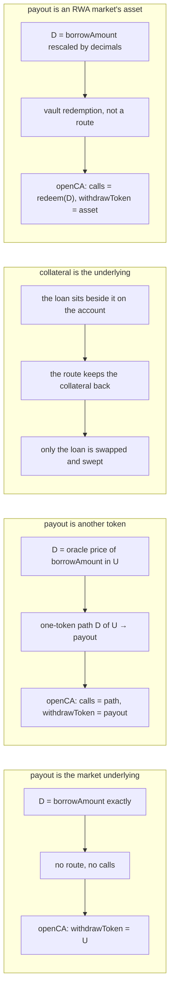

# Borrow against collateral

`prepare.borrow` → `borrowIntent` → `buildBorrowState`
([`borrow.ts`](../../src/onchain/accounts/intents/borrow.ts)).

The second flow with no account to plan against, and the only one whose debt
leaves the account it was drawn on. One transaction opens the account, puts the
collateral on it, draws the loan and sweeps the payout to the wallet — so what
is left behind is the collateral and the debt it backs, and nothing else.

That is the whole of what separates it from
[open-strategy](./open-strategy.md), where the borrowed funds stay and become
part of a position. The loan being the point rather than a means, it is named
outright instead of following from a leverage.

Otherwise the two are the same flow, `creditAccount` included.

## Shape

```text
margin = price(collateral → U)              what the wallet puts up, in underlying
D      = borrowAmount                       when the payout is U
       = rescale(borrowAmount)              when the payout is an RWA asset of U
       = price(payout → U, borrowAmount)    otherwise
TVL    = margin                             the loan is gone by the end of the call
route  : D of U ─▶ payout                   only when the payout is neither
unwrap : redeem(D) ─▶ asset                 instead of the route, on an RWA market
sweep  : withdrawCollateral(payout, MAX_UINT256, wallet)
```

`MAX_UINT256` on the sweep is why the payout token cannot also be the
collateral: the facade hands over whatever balance it finds, which is the only
way a trade that beat its floor strands nothing — and would take the collateral
with it. The flow refuses that request with `unsupportedCollateralToken` rather
than letting it revert on arrival.

## Graph



## Cases



## An RWA market pays out in the asset, not the wrapper

The underlying of an RWA market is a compliance wrapper — `dcUSDC` over
`USDC` — and it **cannot leave the account**. So a loan drawn from one is paid
in the asset behind it: `borrowToken` is the `USDC`, `borrowAmount` counts in
its units, and that is what arrives in the wallet. Asking for the wrapper is
refused with `unsupportedCollateralToken`, and `maxBorrow` answers `0n` for it.

The leg between the two is not a trade. They convert one for one, so the debt
is `borrowAmount` rescaled by decimals (`toTargetDecimals`, the same helper
`realize` uses) rather than priced through the oracle, the calls come from
`assembleRWAUnwrapCalls` rather than the router, and `minBorrowed` equals
`borrowed` — there is no quote to miss and no floor to sign against.

The redemption is sized to the debt just drawn, not to the balance, so
collateral put up in the wrapper stays wrapped and goes on backing the loan.

This is the rule the rest of the SDK already follows: `plan.ts` unwraps before
every `withdraw`, `assembleCloseCreditAccountCalls` redeems before the sweep of
an exit, and the delayed-withdrawal preview reports the asset as what was
received.

## The ceiling: `prepare.maxBorrow`

`prepare.maxBorrow` → `maxBorrow`
([`maxBorrow.ts`](../../src/onchain/accounts/intents/maxBorrow.ts)) answers the
largest `borrowAmount` a given collateral carries, in the payout token's
units — the Max button of a borrow form.

It is the graph above solved backwards rather than searched. The loan leaves
the account, so the collateral is the whole of what backs the debt and the
health factor is one division away from the amount:

```text
backed = min(quota · price(U), price(collateral) · LT)   what the check counts
D      = backed / targetHF                               the most the debt may be worth
       ∧ maxBorrowAmount()                               pool liquidity, manager allowance, maxDebt
answer = price(U → payout, D)                            back into the token asked for
                                                         (rescaled, for an RWA asset)
```

`minDebt` is not a term: see [below](#mindebt-is-a-floor-and-the-ceiling-is-not-held-to-it).

`backed` is [`collateralValuation`](../../src/onchain/accounts/intents/collateral-valuation.ts)'s,
so the valuation is the collateral check's own — safe prices, thresholds and
the quota cap included — and the quota is the very one the borrow will buy,
taken from the same `borrowCollateralQuota`. Every division truncates, which is
what keeps the answer under the check rather than at it.

Synchronous: the account does not exist yet, so nothing is read and a form can
ask on every keystroke. `0n` means this market funds no loan of this shape at
any size — a collateral worth nothing at safe prices, a payout in the
collateral token, a market with nothing left to lend, or a manager the SDK does
not hold yet.

### `minDebt` is a floor, and the ceiling is not held to it

`maxBorrow` is a ceiling, not a verdict, so the facade's `minDebt` is left out
of it. Applied, a market whose floor is 200k would answer `0` for 10k of
collateral — hiding the ~8.4k that collateral does carry, which is the number a
user needs in order to see how far short they are.

What comes back is therefore an amount `borrow` may still refuse, and the
refusal is the better place for it: `debtOutOfRange` carries `requested`,
`minDebt` and `maxDebt` together, so a form can say "this collateral borrows
8362, the market lends no less than 200000" from one error rather than from a
zero it has to explain by itself.

The other bounds stay in, because they are ceilings like this one: pool
liquidity, the manager's allowance and `maxDebt` all cap what may be drawn, and
a `0n` from any of them means there is genuinely nothing to offer.

## Notes

- `borrowed` and `minBorrowed` are the two halves of the payout: what the route
  is expected to return and the floor it guarantees. They coincide when the
  payout is the underlying, or the asset an RWA market unwraps it into, since
  then nothing is traded — the debt drawn is the amount handed over. See
  [Two amounts per routed leg](./README.md#two-amounts-per-routed-leg).
- The collateral check is made at **safe prices**, unlike an opening's. The
  transaction hands funds to the wallet, so that is the feed the credit manager
  judges it on; a loan the collateral covers at main prices and not at reserve
  ones is refused here rather than reverted on chain.
- There is one quota branch, not two. An opening reports both because the
  balances it lands on are a router quote; here the account is left holding the
  collateral the caller named, and a named amount has no floor to differ from.
  `execute.buildTx` passes it as both `averageQuota` and `minQuota`.
- `slippage` rides back on the state so a screen can label the floor it is
  showing without keeping the request around.
- `state.creditAccount` is the account the loan was simulated against, set only
  where one was reused. `execute.buildTx` reads it rather than asking the caller
  again, so the transaction cannot be built against an account the numbers were
  not computed for. It feeds `openCA.reopenCreditAccount`.
- `BorrowState` **is** an `OperationState`, not a shape resembling one, so the
  result goes to
  [`checkSimulation`](../../src/onchain/validation/checkSimulation.ts) as it
  stands — a caller holding a borrow can ask for a stricter health factor than
  the facade's `1.0` without unwrapping anything. An opening is taken by the
  other branch of the same union, which names its quotas `averageQuota`.
- `executionCost` is `undefined` here, the third case that field allows. The
  rate compares an account against itself before and after an operation, and a
  borrow has no second state of it to compare: the payout goes to the wallet.
  What the route cost is on the state already — `borrowed` against `totalDebt`,
  in the tokens rather than as a rate, with `priceImpact` beside them for the
  depth the probe found.
- Read back off its own calldata, a borrow is an opening: `previewOperation`
  answers an `OpenCreditAccount` preview, with the payout in
  `collateralWithdrawn` and the account valued at what it kept — so
  `estNetValue` is the collateral less the debt, as `netValue` is here. The two
  sides are held to that in
  [`previewMatchesPrepare`](../../src/onchain/preview/preview/previewMatchesPrepare.test.ts).

## Reusing a pre-opened account

`params.creditAccount` draws the loan on an account the wallet already holds
instead of opening another. What it requires is what an opening requires: the
same credit manager, no debt and no quota — see
[open-strategy](./open-strategy.md#reusing-a-pre-opened-account), and
[empty-account.md](./empty-account.md) for the flow that hands one out.

Balances already sitting on it stay where they are and are **not** counted
towards the health factor, so the loan this allows is the one the named
collateral carries on its own. The exception is a balance in the payout token:
the sweep takes the whole balance of the token it names, so that one leaves
with the loan.
