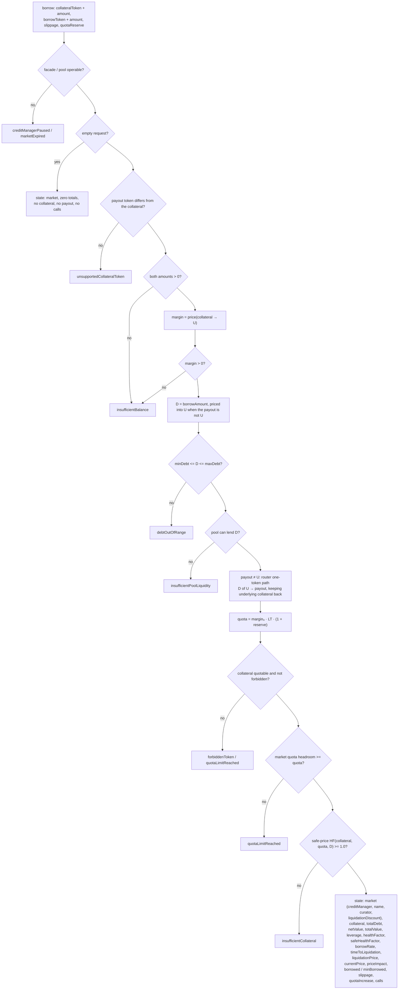
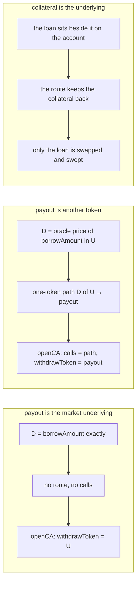

# Borrow against collateral

`prepare.borrow` → `borrowIntent` → `buildBorrowState`
([`borrow.ts`](../../src/onchain/accounts/intents/borrow.ts)).

The second flow with no account to plan against, and the only one whose debt
leaves the account it was drawn on. One transaction opens the account, puts the
collateral on it, draws the loan and sweeps the payout to the wallet — so what
is left behind is the collateral and the debt it backs, and nothing else.

That is the whole of what separates it from
[open-strategy](./open-strategy.md), where the borrowed funds stay and become
part of a position. The loan being the point rather than a means, it is named
outright instead of following from a leverage.

Otherwise the two are the same flow, and take the same two shapes besides the
loan itself. `empty: true` hands out an account and draws nothing — the request
is the market and nothing else. `creditAccount` draws the loan on an account
the wallet already holds instead of opening another; it must belong to the
manager and carry no debt and no quota, which is exactly what either empty
request leaves behind, so an account from one flow is accepted by the other.
Balances already on a reused account stay where they are and are not counted
towards the health factor — the loan is the one the named collateral carries —
except a balance in the payout token, which the sweep takes along with the loan.

## Shape

```text
margin = price(collateral → U)              what the wallet puts up, in underlying
D      = borrowAmount                       when the payout is U
       = price(payout → U, borrowAmount)    otherwise
TVL    = margin                             the loan is gone by the end of the call
route  : D of U ─▶ payout                   only when the payout is not U
sweep  : withdrawCollateral(payout, MAX_UINT256, wallet)
```

`MAX_UINT256` on the sweep is why the payout token cannot also be the
collateral: the facade hands over whatever balance it finds, which is the only
way a trade that beat its floor strands nothing — and would take the collateral
with it. The flow refuses that request with `unsupportedCollateralToken` rather
than letting it revert on arrival.

## Graph



## Cases



## The ceiling: `prepare.maxBorrow`

`prepare.maxBorrow` → `maxBorrow`
([`maxBorrow.ts`](../../src/onchain/accounts/intents/maxBorrow.ts)) answers the
largest `borrowAmount` this flow will accept for a given collateral, in the
payout token's units — the Max button of a borrow form.

It is the graph above solved backwards rather than searched. The loan leaves
the account, so the collateral is the whole of what backs the debt and the
health factor is one division away from the amount:

```text
backed = min(quota · price(U), price(collateral) · LT)   what the check counts
D      = backed / targetHF                               the most the debt may be worth
       ∧ maxBorrowAmount()                               pool liquidity, manager allowance, maxDebt
answer = price(U → payout, D)                            back into the token asked for
```

`backed` is [`collateralValuation`](../../src/onchain/accounts/intents/collateral-valuation.ts)'s,
so the valuation is the collateral check's own — safe prices, thresholds and
the quota cap included — and the quota is the very one the borrow will buy,
taken from the same `borrowCollateralQuota`. Every division truncates, which is
what keeps the answer under the check rather than at it.

Synchronous: the account does not exist yet, so nothing is read and a form can
ask on every keystroke. `0n` means this market funds no loan of this shape — a
debt under `minDebt`, a collateral worth nothing at safe prices, a payout in
the collateral token, or a manager the SDK does not hold yet.

## Notes

- `borrowed` and `minBorrowed` are the two halves of the payout: what the route
  is expected to return and the floor it guarantees. They coincide when the
  payout is the underlying, since then nothing is traded — the debt drawn is the
  amount handed over. See
  [Two amounts per routed leg](./README.md#two-amounts-per-routed-leg).
- The collateral check is made at **safe prices**, unlike an opening's. The
  transaction hands funds to the wallet, so that is the feed the credit manager
  judges it on; a loan the collateral covers at main prices and not at reserve
  ones is refused here rather than reverted on chain.
- There is one quota branch, not two. An opening reports both because the
  balances it lands on are a router quote; here the account is left holding the
  collateral the caller named, and a named amount has no floor to differ from.
  `execute.buildTx` passes it as both `averageQuota` and `minQuota`.
- `slippage` rides back on the state so a screen can label the floor it is
  showing without keeping the request around.
- `state.creditAccount` is the account the loan was simulated against, set only
  where one was reused. `execute.buildTx` reads it rather than asking the caller
  again, so the transaction cannot be built against an account the numbers were
  not computed for. It feeds `openCA.reopenCreditAccount`.
- An empty borrow is recognised downstream by its zero debt: a loan of nothing
  is refused at `prepare`, so no funded state can be mistaken for one.
