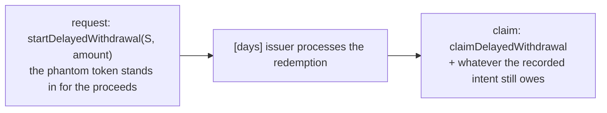
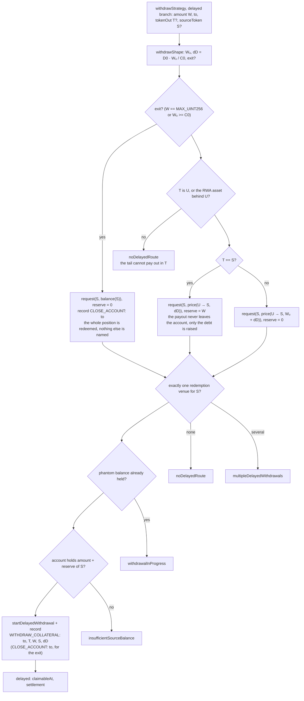
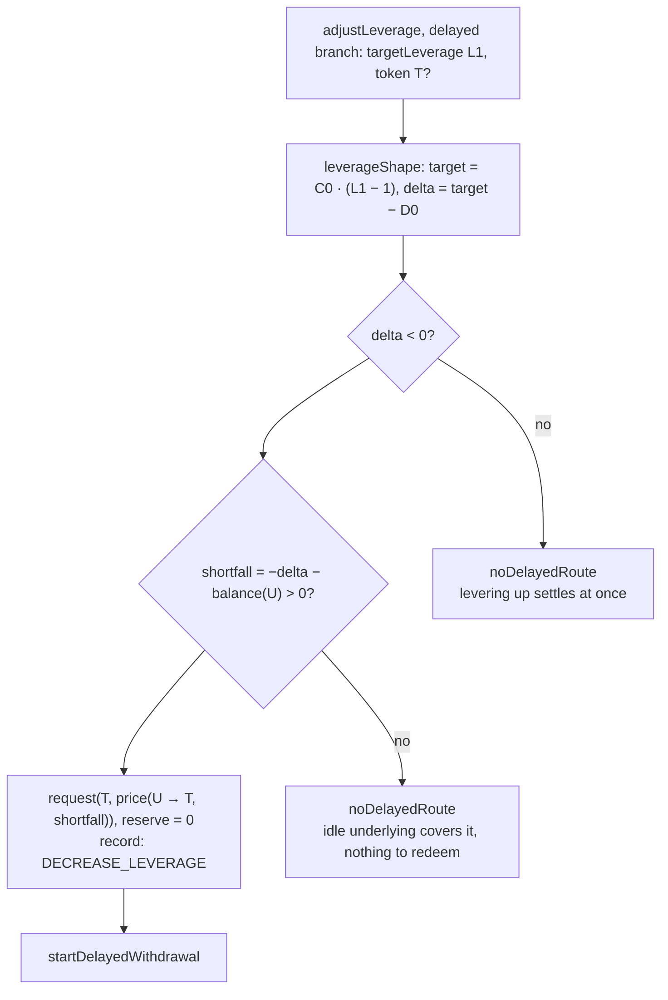
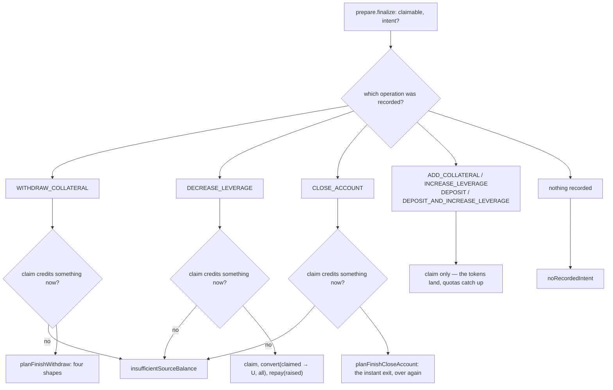
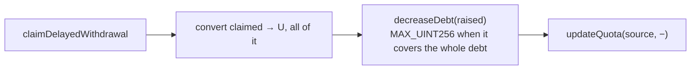
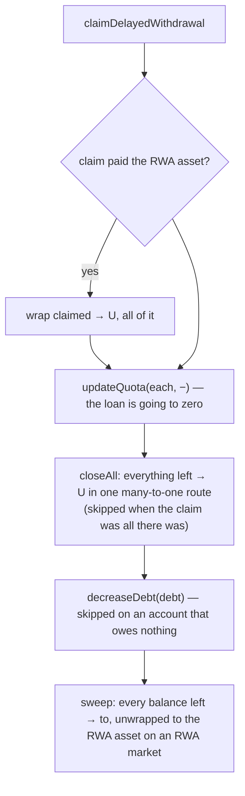
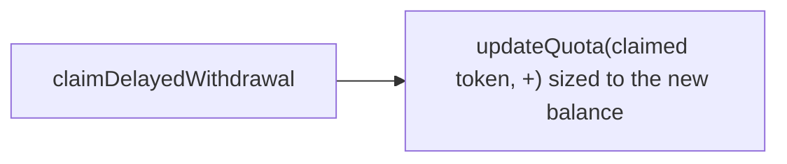

# Delayed routes: request now, finish later

Some collateral does not sell on a DEX — a Securitize dsToken, a Mellow share.
It redeems through its issuer, which answers a request now and pays out days
later. Two of the intents can take that route:
[withdraw](./withdraw.md) and [adjust leverage](./adjust-leverage.md).

Two transactions rather than one, and nothing has to be kept on the client in
between: the request writes the operation into the withdrawal's `extraData`, and
reading the claimable decodes it back.

- the request half → `planWithdrawDelayed` / `planAdjustLeverageDelayed`
- `prepare.finalize` → `planFinishWithdraw` / `planFinishDecreaseLeverage` /
  `planFinishCloseAccount` / `planFinishClaimOnly`

There is no separate entry point for the request: `prepare.withdrawStrategy` and
`prepare.adjustLeverage` quote this route alongside the instant one, in the
`delayed` field of their answer, and which routes exist is what the caller wanted
to know in the first place.

## The two halves

While the phantom balance sits on the account it is neither sellable nor
withdrawable, so a second request for the same asset is refused
(`withdrawalInProgress`), and so is an instant exit.

## What the preview reports

The request is half an operation, so the state it lands in is not an answer to
"what does this do to my position": the debt still stands, nothing has been paid
out, and the position sits in the phantom token. So `preview` is the far side —
the account once the redemption has matured, been claimed and the tail has run —
which is the same place the instant route reaches in one transaction, and what
makes the two routes comparable at all.

The half-way state is still reported, as `delayed.afterRequest`: that is what
the facade judges when the transaction lands, so it is the one the engine's
guards are applied to. Both are validated, so a request whose tail could not be
completed is refused rather than started.

The tail is walked by the same realiser as everything else (`realize`), with one
substitution: routed legs are priced by the oracle instead of the pathfinder,
because the funds they trade do not exist yet and no calldata is being produced.
Its half of the numbers is therefore an estimate; `operations` and `calls` are
the request alone, and those are exact.

## Leading half: withdraw

Same arithmetic as the instant flow — `withdrawShape` is shared, so the two
routes cannot disagree on the amounts — and then a single `request` step.

`settlement` is `"delayed"` when any output of the redemption matures later, and
`"instant"` when the venue happens to pay out at once — in which case the request
already is the whole operation.

## Leading half: adjust leverage

Only deleveraging reaches here, and only for the part idle underlying does not
already cover.

## Tails

`finalize` claims the matured withdrawal and then plans whatever the recorded
operation still owes, against the account **as it stands now** — not as it stood
when the request was signed.

### `WITHDRAW_COLLATERAL`, four shapes

The claim is split between the payout the wallet was promised and the debt the
leading half deferred. The payout is served first, so a routing shortfall shows
up as leverage a touch above target rather than as a payout that came up short.

```mermaid
flowchart TD
  subgraph a["dD == 0: the whole claim is payout"]
    a1["claimDelayedWithdrawal"] --> a2["convert claimed → T, all of it"] --> a3["withdrawCollateral(T, min(raised, W), to)"]
  end
  subgraph b["S == T: the payout was already on the account"]
    b1["claimDelayedWithdrawal"] --> b2["convert claimed → U, all of it"] --> b3["decreaseDebt(min(raised, dD))"] --> b4["withdrawCollateral(T, W, to)"]
  end
  subgraph c["T == U: payout and debt both want the underlying"]
    c1["claimDelayedWithdrawal"] --> c2["convert claimed → U, all of it"] --> c3["decreaseDebt(dD), keeping W back"] --> c4["withdrawCollateral(U, min(raised, W), to)"]
  end
  subgraph d["T is the RWA asset, the debt wants U"]
    d1["claimDelayedWithdrawal"] --> d2["reserved = min(price(T → claimed, W), claimed)"] --> d3["convert claimed → U, claimed − reserved"] --> d4["decreaseDebt(min(raised, dD))"] --> d5["unwrap / convert reserved → T"] --> d6["withdrawCollateral(T, min(raised, W), to)"]
  end
```

A payout in `T` that is neither the underlying nor the RWA asset behind it is
refused (`noDelayedRoute`) — the leading half checks the same thing, so this only
fires when the account's market changed shape in between.

### `DECREASE_LEVERAGE`

Everything claimed goes into the debt: the request only ever asked for the
shortfall, so there is nothing to hand back.

### `CLOSE_ACCOUNT`

The leading half redeemed the position and could name nothing else: how much the
redemption pays, what the debt has grown to and what else is on the account by
then are all unknowable days in advance. So this half is the
[instant exit](./withdraw.md) over again, run against the account the claim
finds.

This is what lets a position that only redeems through its issuer leave at all:
the instant exit needs a route for the whole account, and there is none.

### Claim only

For the operations that were never interrupted by the delay — collateral added,
leverage raised, a deposit — the claim is the whole tail: the tokens land on the
account and only their quota has to catch up.

## Notes

- The tail is planned at claim time, not stored: only then are the claimed amount
  and the token it arrived in known. The projection behind `preview` plans the
  same tail from the claim the request implies, so the two cannot drift apart.
- `intent` can be passed explicitly for a compressor too old to report what the
  request recorded.
- Requests and claims carry calldata the compressor produces; the intent engine
  does not build those calls itself.
- Tests: [`start-delayed.onchain.test.ts`](../../src/sdk/accounts/intents/tests/start-delayed.onchain.test.ts),
  [`finish-withdraw.onchain.test.ts`](../../src/sdk/accounts/intents/tests/finish-withdraw.onchain.test.ts),
  [`finish-decrease-leverage.onchain.test.ts`](../../src/sdk/accounts/intents/tests/finish-decrease-leverage.onchain.test.ts),
  [`finish-claim-only.onchain.test.ts`](../../src/sdk/accounts/intents/tests/finish-claim-only.onchain.test.ts),
  [`finish-close-account.onchain.test.ts`](../../src/sdk/accounts/intents/tests/finish-close-account.onchain.test.ts).
