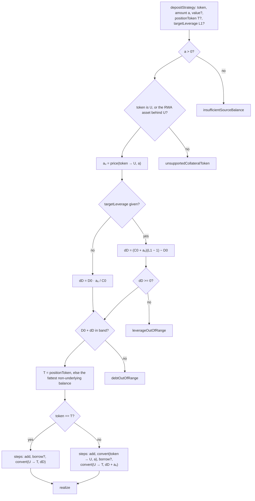

# Deposit into a strategy

`prepare.depositStrategy` → `startIntent({ type: "DEPOSIT" })` → `planDeposit`
([`plan.ts`](../../src/sdk/accounts/intents/plan.ts)).

Collateral comes in from the wallet and the debt grows with it — at the
account's current leverage by default, or to a target the caller names.

## Math

```text
a       = deposited amount, in its own token
aᵤ      = price(token → U, a)                     the deposit in underlying
dD      = D0 · aᵤ / C0                            keep leverage           (default)
dD      = C0' · (L1 − 1) − D0, C0' = C0 + aᵤ      reach L1                (targetLeverage)
require dD >= 0                                   else leverageOutOfRange
require D0 + dD in band                           else debtOutOfRange
buy     = dD + aᵤ                                 of U routed into T
```

Only the market underlying — or its raw asset on an RWA market — can be
deposited; anything else is `unsupportedCollateralToken`.

## Graph



## Cases and the calls they assemble

```mermaid
flowchart TD
  subgraph a["deposit in U, position token T, leverage kept"]
    a1["addCollateral(U, a)"] --> a2["increaseDebt(dD)"] --> a3["swap: U → T, dD + a"] --> a4["updateQuota(T, +)"]
  end
  subgraph b["deposit already in T (e.g. topping up the position token)"]
    b1["addCollateral(T, a)"] --> b2["increaseDebt(dD)"] --> b3["swap: U → T, dD"] --> b4["updateQuota(T, +)"]
  end
  subgraph c["deposit in the RWA asset of an RWA market"]
    c1["addCollateral(asset, a)"] --> c2["wrapRwaCollateral: asset → U, 1:1 up to decimals"] --> c3["increaseDebt(dD)"] --> c4["swap: U → T"] --> c5["updateQuota(T, +)"]
  end
  subgraph d["debt-free account (D0 = 0, no target)"]
    d1["dD = 0, no increaseDebt"] --> d2["swap: U → T, a"] --> d3["updateQuota(T, +)"]
  end
  subgraph e["deposit in T with dD = 0"]
    e1["addCollateral(T, a) — the whole plan"] --> e2["updateQuota(T, +)"]
  end
```



A convert of amount `0` is dropped by the planner, and an identity convert
(`from == to`) by the realiser — which is why case (e) is a single call, and why
one planner covers every "is the deposit already the position token" shape.

## Guards on the way out

| Check                | Refusal                                  |
| -------------------- | ---------------------------------------- |
| pool can lend `dD`   | `insufficientPoolLiquidity`              |
| `T` quotable, not forbidden | `quotaLimitReached`, `forbiddenToken` |
| market quota headroom | `quotaLimitReached`                     |
| HF of the projected state (main prices — nothing leaves) | `insufficientCollateral` |

## Notes

- `value` rides along on `addCollateral` for a wrapped-native market paid in the
  coin.
- The swap output is the pathfinder **floor**, so the projected `T` balance and
  its quota are what survives the worst allowed slippage.
- Leverage in the reported state is `debt / equity` (the read model's
  convention), not the `TVL / C` used in the formulas above.
