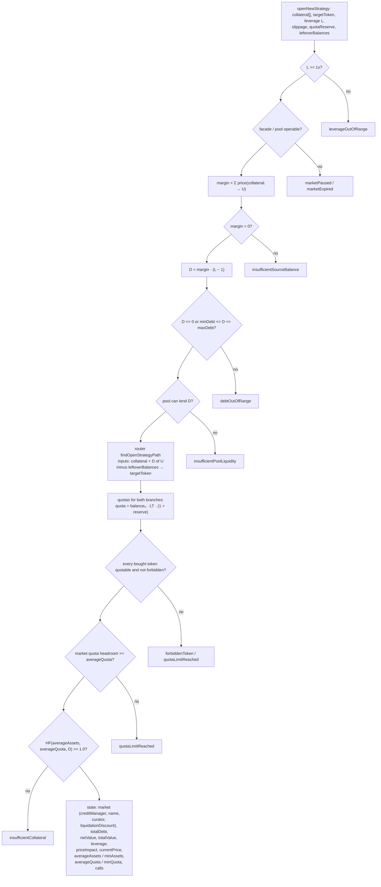
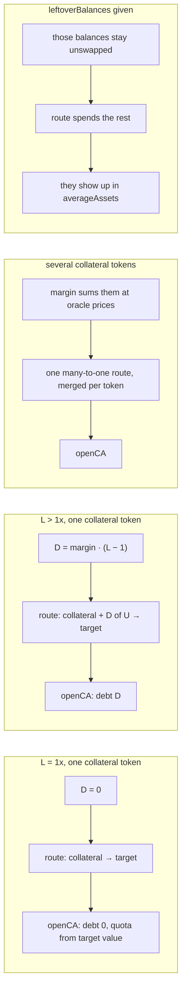

# Open a new strategy

`prepare.openNewStrategy` → `openStrategyIntent` → `buildOpenStrategyState`
([`open-strategy.ts`](../../src/onchain/accounts/intents/open-strategy.ts)).

The one flow with no account to plan against: there is nothing on chain until
the transaction lands, so it emits no steps and no operation chain. The output
is the set of numbers `sdk.accounts.openCA` needs, plus the router path.

## Shape

```text
margin = Σ price(collateralᵢ → U)          own funds, in underlying
D      = margin · (L − 1) / LEVERAGE_DECIMALS
TVL    = margin + D
route  : {collateral…, D of U} ─ minus leftovers ─▶ target token
```

Both branches of the route are reported, which no other flow does: the
pathfinder returns expected and floor balances from one call, and `openCA` wants
`averageQuota` and `minQuota` to bracket the quota it buys.

## Graph



## Cases



## Notes

- The transaction is `openCreditAccount`, not a multicall assembled here, so
  there are no `AccountCalculatorOperation`s and no quota "update" — a fresh
  account starts at zero quota, so the increase **is** the level to buy.
- Growth, headroom and the collateral check are all judged on the **expected**
  branch; the floor branch only feeds `minQuota`. The collateral check differs
  from the one every other flow makes, which weighs the floor — `openCA` hands
  the facade both branches, so the floor is not the whole of what the transaction
  promises. See [Two amounts per routed leg](./README.md#two-amounts-per-routed-leg).
- The requested `leverage` is total leverage (`300n` = 3x), not the debt
  multiple. The `leverage` the preview answers with is the read model's plain
  multiplier (`3`), as `StrategyPosition.leverage` reports it.

## The empty opening

`params.empty` opens the account and stops there: no collateral leaves the
wallet, no debt is drawn, no route is quoted, and no quota is bought. It exists
so a wallet can hold an account ahead of being allowed to use one — which
markets want that is the caller's decision, and the SDK does not gate it.

```text
openCreditAccount(wallet, calls, 0)
  calls = the price updates the market demands, and nothing else
```

`collateral` must be empty; `leverage` and `targetToken` are not read: with no
collateral the debt is zero at any leverage, and there is nothing to route
anywhere. A market with no strategy target can still hand out an account.

Taken as an early branch in `buildOpenStrategyState` rather than threaded
through the walk, for one concrete reason: `findOpenStrategyPath` has no guard
for an empty basket and would still make its `eth_call` — unlike
`findBestClosePath`, which short-circuits. The only check the branch runs is
`assertMarketOperable`.

The account it leaves behind reports `debt` and `totalValue` of zero and stores
`MAX_UINT256` as its health factor, which both the projection and the read path
report as `MAX_UINT16` (65535). `positions.list` returns it — the compressor is
queried with `includeZeroDebt` unless a filter says otherwise. A caller's own
list may still hide it: `PositionFilter.isZeroDebt` is what drops such rows.
