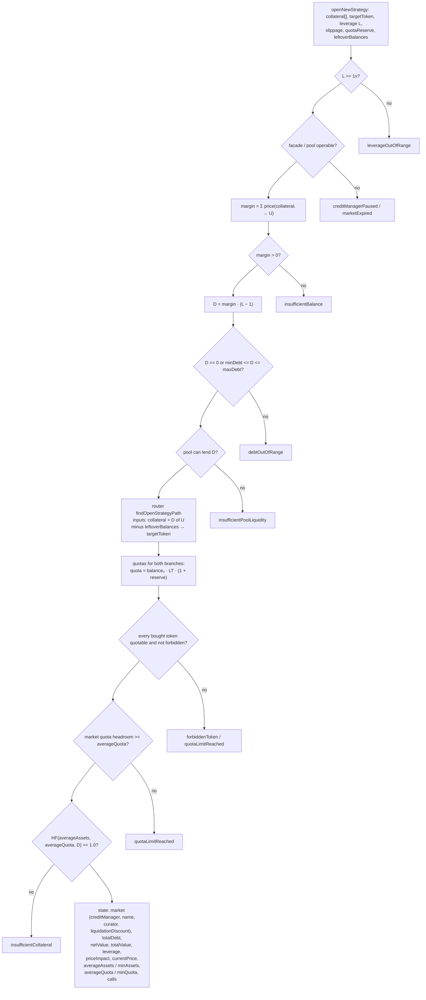
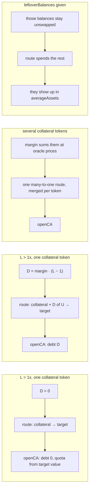

# Open a new strategy

`prepare.openNewStrategy` → `openStrategyIntent` → `buildOpenStrategyState`
([`open-strategy.ts`](../../src/onchain/accounts/intents/open-strategy.ts)).

The one flow with no account to plan against: there is nothing on chain until
the transaction lands, so it emits no steps and no operation chain. The output
is the set of numbers `sdk.accounts.openCA` needs, plus the router path.

## Shape

```text
margin = Σ price(collateralᵢ → U)          own funds, in underlying
D      = margin · (L − 1) / LEVERAGE_DECIMALS
TVL    = margin + D
route  : {collateral…, D of U} ─ minus leftovers ─▶ target token
```

Both branches of the route are reported, which no other flow does: the
pathfinder returns expected and floor balances from one call, and `openCA` wants
`averageQuota` and `minQuota` to bracket the quota it buys.

## Graph



## Cases



## Notes

- The transaction is `openCreditAccount`, not a multicall assembled here, so
  there are no `AccountCalculatorOperation`s and no quota "update" — a fresh
  account starts at zero quota, so the increase **is** the level to buy.
- Growth, headroom and the collateral check are all judged on the **expected**
  branch; the floor branch only feeds `minQuota`. The collateral check differs
  from the one every other flow makes, which weighs the floor — `openCA` hands
  the facade both branches, so the floor is not the whole of what the transaction
  promises. See [Two amounts per routed leg](./README.md#two-amounts-per-routed-leg).
- The requested `leverage` is total leverage (`300n` = 3x), not the debt
  multiple. The `leverage` the preview answers with is the read model's plain
  multiplier (`3`), as `StrategyPosition.leverage` reports it.

## Opening an account that holds nothing

An opening always opens with something. A wallet that wants the account and
nothing else asks `prepare.openEmptyCreditAccount`, which is its own flow:
[empty-account.md](./empty-account.md).

## Reusing a pre-opened account

`params.creditAccount` puts the position on an account that already exists
instead of creating one. Any account of the same credit manager carrying no
debt and no quotas qualifies. The projection is identical either way; only the
transaction differs.

```text
state.creditAccount ─▶ openCA.reopenCreditAccount ─▶ multicall(account, calls)
              absent ─▶                              openCreditAccount(wallet, calls, ref)
```

The account it was simulated against rides back on the result rather than being
asked of the caller again at `buildTx`, so the transaction cannot be built
against an account the numbers were not computed for.

**The account must carry no debt and no quotas**, and `openNewStrategy` refuses
with `creditAccountNotEmpty` when it does. `averageQuota` / `minQuota` are
absolute levels encoded as `updateQuota` deltas from zero, so an account already
holding quotas would be sized against the wrong starting point. Balances on it
are simply routed with the rest.

Growing a position that already exists is `depositStrategy`, not this.

An account on a different credit manager, or one the SDK cannot find, refuses
with `creditAccountNotFound`.
