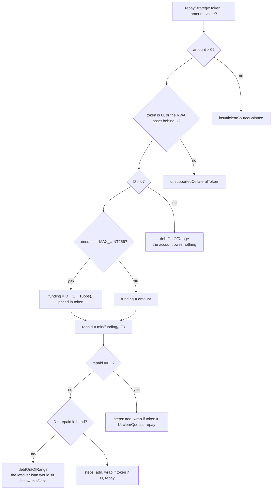

# Repay a strategy

`prepare.repayStrategy` → `startIntent({ type: "REPAY" })` → `planRepay`
([`plan.ts`](../../src/onchain/accounts/intents/plan.ts)).

Funding comes in from the wallet and goes straight into the debt. The collateral
never moves, so the whole plan is the funding's way to the underlying — and
leverage falls because the debt does.

A loan is denominated in the underlying, so funding sent in it has no way to
travel: it lands and is repaid, two calls, no router and no quota touched. The
one other accepted token is the unwrapped asset behind an RWA underlying (USDC
rather than dcUSDC), and the way there is the wrapper's own 1:1 conversion, not a
swap. Anything else is refused.

## Math

```text
funding = amount                                     a figure the caller names
funding = price(U → token, D · (1 + 10bps))          amount == MAX_UINT256
repaid  = min(price(token → U, funding), D)          the excess is not a repayment
require D − repaid in band                           else debtOutOfRange
```

Anything above the debt stays on the account as collateral. That is deliberate:
it lets a wallet meaning to settle send the debt plus a buffer and still clear it
when interest has accrued between the quote and the block. `MAX_UINT256` asks for
that settlement without naming a figure — the margin is 10bps of the debt, which
is hours of mempool at any sane borrow rate.

`maxRepay` reports the debt as of the read: principal, interest and fees.

## Case selection



## Cases and the calls they assemble

```mermaid
flowchart TD
  subgraph a["partial repayment in U"]
    a1["addCollateral(U, amount)"] --> a2["decreaseDebt(amount)"] --> a3["quotas untouched — no balance changed"]
  end
  subgraph b["partial repayment in the RWA asset"]
    b1["addCollateral(asset, amount)"] --> b2["wrapRwaCollateral: asset → U, 1:1 up to decimals"] --> b3["decreaseDebt(amountᵤ)"]
  end
  subgraph c["settlement: amount >= D, or MAX_UINT256"]
    c1["addCollateral(U, D + margin)"] --> c2["updateQuota(tokenᵢ, MIN_INT96) for every quoted token"] --> c3["decreaseDebt(MAX_UINT256)"] --> c4["the margin stays on the account as collateral"]
  end
```



`decreaseDebt` takes the sentinel whenever the payment covers the whole debt, so
the interest of the blocks between the quote and the transaction is repaid too
rather than left as dust below `minDebt`.

Quotas move in exactly one of these cases, the settlement, and they move before
the debt does. Both halves of that are forced, from opposite sides: a loan cannot
go to zero while its quotas are alive (`DebtToZeroWithActiveQuotasException`), and
a quota cannot be touched once the loan is gone
(`UpdateQuotaOnZeroDebtAccountException`). So `updateQuota` has exactly one place
to stand — after the funding lands, before `decreaseDebt` — which is also the
only order in which a quota never outlives the debt it backed and goes on
charging an account that owes nothing. A payment the loan survives leaves the
quotas where they are.

Case (a) is two calls because funding in `U` is planned without a conversion step
at all, and case (b) is three because the wrapper's 1:1 conversion is a real
call.

## Guards on the way out

| Check                                        | Refusal                    |
| -------------------------------------------- | -------------------------- |
| the account holds what the wrap spends (RWA funding only) | `insufficientSourceBalance`|
| nothing forbidden or unquotable grew         | `forbiddenToken`, `quotaLimitReached` |
| HF of the projected state (main prices — nothing leaves) | `insufficientCollateral` |

A repayment only improves the health factor, so the last check is a formality —
except on an account already underwater, where it is the reason a rescue in one
transaction is refused if it does not finish above 1.0.

## Notes

- Position untouched: no router call, no swap, no payout. The only reason a
  quota moves is a settlement, which drops all of them.
- `value` rides along on `addCollateral` for a wrapped-native market paid in the
  coin.
- The position itself is not sold to pay the debt — that is
  [adjust-leverage](./adjust-leverage.md), which deleverages out of collateral.
- Tests: [`repay.onchain.test.ts`](../../src/onchain/accounts/intents/tests/repay.onchain.test.ts).
