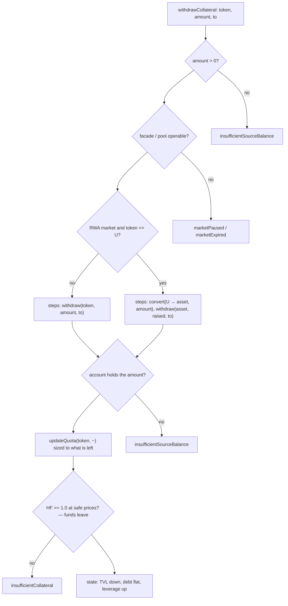
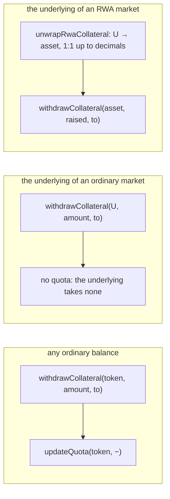

# Withdraw one asset

`prepare.withdrawCollateral` → `startIntent({ type: "WITHDRAW_ASSET" })` →
`planWithdrawAsset` ([`plan.ts`](../../src/onchain/accounts/intents/plan.ts)).

A balance already on the account leaves it, in the token it stands in. No swap,
no repayment — the mirror of [add collateral](./add-collateral.md), and the
counterpart of [withdraw](./withdraw.md), which sells and repays to keep leverage
where it was.

Because the debt does not move, leverage **rises**: the same loan now stands on
less of the account's own funds. This is the intent most likely to be refused on
collateralisation.

## Math

```text
require amount > 0
C1 = C0 − price(token → U, amount)
D1 = D0                                untouched
L1 = TVL1 / C1                          rises
```

## Graph



## Cases and the calls they assemble



The wrapped underlying of an RWA market cannot leave the account, so the payout
is unwrapped into the raw asset on the way out — the same `payout` helper every
flow that pays a wallet goes through.

## Notes

- The amount is named, not swept: `withdrawCollateral` carries the figure the
  projection was built on. Only an [exit](./withdraw.md) hands over "whatever the
  balance turns out to be".
- Because funds leave, the closing collateral check is judged at **safe prices** —
  the lower of each token's main and reserve feed — which is what the credit
  manager does. A withdrawal that looks fine at main prices can still be refused
  here.
- A quota is dropped to `MIN_INT96` only when the whole balance goes; a partial
  withdrawal shrinks it to fit what is left.
- Tests: [`withdraw-asset.onchain.test.ts`](../../src/onchain/accounts/intents/tests/withdraw-asset.onchain.test.ts).
