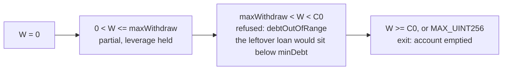
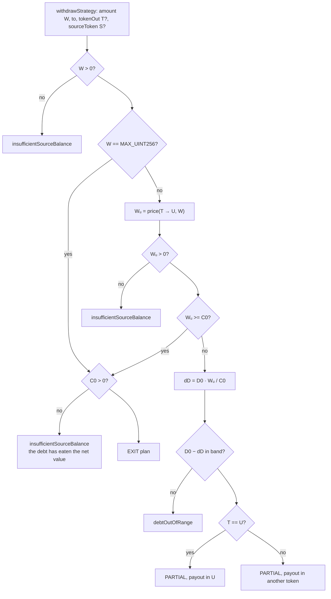
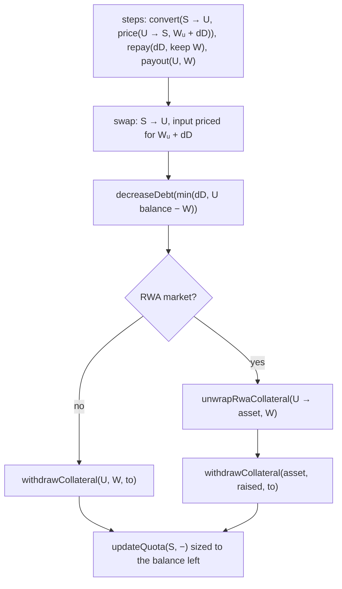
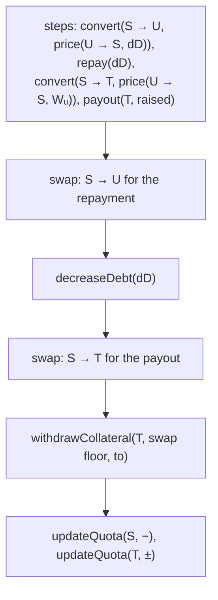
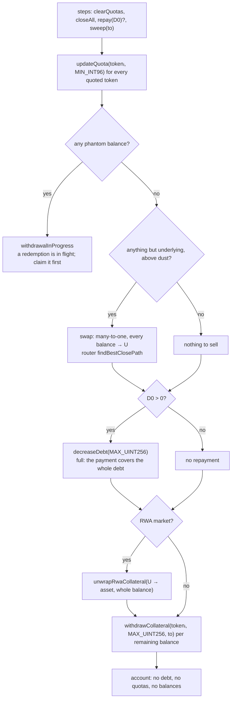

# Withdraw from a strategy

`prepare.withdrawStrategy` → `intentRoutes({ type: "WITHDRAW" })` →
`planWithdraw` ([`plan.ts`](../../src/sdk/accounts/intents/plan.ts)).

Value leaves the account and the debt shrinks in proportion, so leverage holds —
unless the request is for everything, which is an exit and has no leverage left
to hold. Both the router route and the redemption route are quoted; the delayed
half lives in [delayed.md](./delayed.md).

## Math

```text
W       = amount, denominated in T (the payout token)
Wᵤ      = price(T → U, W)
exit    ⟺ W == MAX_UINT256  or  Wᵤ >= C0
dD      = D0 · Wᵤ / C0                   partial: keeps leverage flat
require D0 − dD in band                  else debtOutOfRange
raise   = Wᵤ + dD of U from S            when T == U
        = dD of U, then Wᵤ worth of T    when T ≠ U
```

`maxWithdraw` is the ceiling of the partial flow: the largest `W` whose
proportional repayment still leaves `D0 − dD >= minDebt`, capped at `C0 − 1`.



## Case selection



`S` defaults to the account's most valuable non-phantom balance; `T` defaults to
the market underlying.

## Partial, payout in the underlying (`T == U`)

One leg raises payout and repayment together; the repayment is told to keep `W`
back so the payout is not spent on the debt.



When `S == U` the swap is an identity convert and disappears: the plan becomes
`decreaseDebt` + `withdrawCollateral` out of idle underlying.

## Partial, payout in another token (`T ≠ U`)

Two legs, because the debt wants `U` and the wallet wants `T`.



The payout is the **floor** of the second swap, so the wallet is never promised
more than the worst allowed slippage delivers. When `S == T` the second convert
is an identity and the payout comes straight off the existing balance.

## Exit (`W == MAX_UINT256`, or `W >= C0`)

Everything is sold in one many-to-one route, the loan is settled out of the
proceeds, and what is left goes to the wallet. The quotas go first: quota fees
accrue on the quota, not on the loan, so one outliving the debt it backed would
keep charging an account that owes nothing.



Why the sentinels rather than the quoted amounts:

- `decreaseDebt(MAX_UINT256)` — by the time the transaction lands the debt has
  grown by a few blocks of interest, and repaying the quoted figure would leave
  dust the facade refuses to let stand below `minDebt`.
- `withdrawCollateral(MAX_UINT256)` — the facade reads the balance, so a swap
  that beat its floor does not strand the surplus on the account.
- `updateQuota(MIN_INT96)` — a reset, rather than an amount quota interest may
  have moved.

`tokenOut` and `sourceToken` are ignored by an exit: everything is sold, and the
payout is whatever the route produced.

An exit has a delayed route too, and for a position that only redeems through
its issuer it is the only one — no route exists for the whole account, so this
plan cannot be quoted at all. The request redeems `sourceToken` whole and
records `CLOSE_ACCOUNT`; `prepare.finalize` then runs this same plan against the
account the claim finds, see [delayed.md](./delayed.md).

Balances at or below 10 wei are left where they are — the router's close path
will not route them, and projecting them as sold would make the swept amounts
disagree with reality.

## Guards on the way out

| Check                                    | Refusal                        |
| ---------------------------------------- | ------------------------------ |
| balance actually holds each leg's input  | `insufficientSourceBalance`    |
| no phantom balance to sell (exit)        | `withdrawalInProgress`         |
| nothing forbidden or unquotable grew     | `forbiddenToken`, `quotaLimitReached` |
| HF at **safe prices** — funds leave      | `insufficientCollateral`       |

After an exit the debt is zero, so the health factor reports the no-debt
sentinel and the check is trivially satisfied.

## Notes

- The partial flow never touches quotas explicitly; the closing update sizes
  them to the balances left behind, with `quotaReserve` on top.
- Between `maxWithdraw` and the net value the flow refuses rather than clamping:
  the caller gets a reason it can show, not a number it did not ask for.
- Tests: [`withdraw.onchain.test.ts`](../../src/sdk/accounts/intents/tests/withdraw.onchain.test.ts),
  [`withdraw-all.onchain.test.ts`](../../src/sdk/accounts/intents/tests/withdraw-all.onchain.test.ts),
  [`plan.test.ts`](../../src/sdk/accounts/intents/plan.test.ts).
