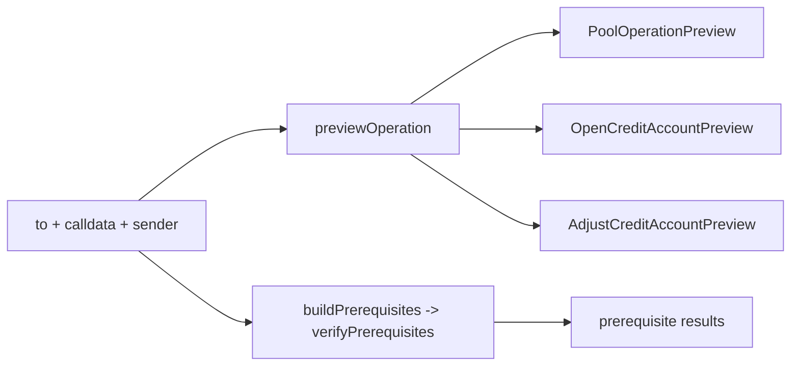

# Preview

Tools for **previewing a Gearbox operation before it is sent on-chain**: turn raw
transaction calldata into an operation-specific, human-displayable preview, and
check the conditions the sender must satisfy for it to succeed.

## Concepts

An **operation** is a transaction performed on behalf of a Gearbox protocol user:

- a **pool user** (liquidity provider) depositing into or redeeming from a pool, or
- a **credit account user** (borrower) opening or adjusting a credit account.

Given only `{ to, calldata, sender }`, this module answers two questions:

1. **What would this operation do?** (`previewOperation`)
2. **Can the sender execute it, and what must they fix first?** (`buildPrerequisites` / `verifyPrerequisites`)

All reads use the already-attached `OnchainSDK` (chain, RPC and block are baked in
at attach time). The SDK must be created with the adapters plugin so that adapter
contracts resolve during multicall classification.

## Public API

### `previewOperation`

[`previewOperation`](./preview/previewOperation.ts) is the async entry point. It
decodes the raw calldata internally (see [`parse`](#internals)) and assembles an
operation-specific preview:

- **Pool operations** (ERC4626 deposit/mint/withdraw/redeem, direct or
  zapper-routed) produce a [`PoolOperationPreview`](./preview/types.ts): the
  tokens going in and out. The amount on the side that is not present in
  calldata is recovered with an async ERC4626 preview read
  (`previewDeposit`/`previewMint`/`previewWithdraw`/`previewRedeem` on the pool
  or zapper); when that read fails, the side carries `{ token, error }` instead
  of the amount.
- **Credit account opening** (`OpenCreditAccount` and
  `SecuritizeOpenCreditAccount`) produces an
  [`OpenCreditAccountPreview`](./preview/types.ts): collateral, collateral
  value in underlying, debt, quotas and the minimal assets on the account after
  opening (recovered from the router's `storeExpectedBalances` deltas — since
  the account is being opened, initial balances are all zero). No simulation
  call is needed.
- **Credit account adjustment** (`multicall`/`botMulticall` on the facade and
  `SecuritizeMulticall` on the RWA factory) produces an
  [`AdjustCreditAccountPreview`](./preview/types.ts): collateral added and
  withdrawn, debt, quotas, the minimal guaranteed assets after the operation,
  and the changes of each relative to the account's pre-state. The pre-state
  is fetched with one credit account compressor read (or taken from
  `options.creditAccount` when the caller already holds it), then the
  multicall is replayed over it using the same balance-threading logic as
  account opening. Adapter calls outside a
  `storeExpectedBalances`/`compareBalances` bracket (e.g. reward claims, RWA
  wrap/unwrap) are ignored: nothing enforces their outcome on-chain, so their
  guaranteed balance change is zero.
- **Any other operation** throws an
  [`UnsupportedOperationError`](./preview/errors.ts).

### `prerequisites`

The on-chain conditions the **sender can fix themselves** before retrying.

- [`buildPrerequisites`](./prerequisites/buildPrerequisites.ts) takes the same
  raw-calldata input as `previewOperation` and derives the prerequisites (token
  allowances and balances for deposits, redeems, collateral, partial
  liquidation; RWA open-account requirements for RWA-factory open operations).
  For RWA open operations the prerequisite detail is the exact
  `sdk.accounts.getOpenAccountRequirements` output, so consumers can use it to
  fill in the operation's template `tokensToRegister`/`signaturesToCache`.
- [`verifyPrerequisites`](./prerequisites/runPrerequisites.ts) checks them all in a
  single resilient `multicall` (`allowFailure: true`); each prerequisite resolves
  its own slice into an `AnyPrerequisiteResult` (`satisfied` or `error`).

Only **sender-actionable** conditions belong here (approve a token, top up a
balance, register an RWA token / sign the factory's EIP-712 messages).
Non-actionable protocol/admin state (pool pause, available liquidity,
health factor, bot permissions, degen NFT gating) is intentionally out of scope.

## Intended usage

```ts
import {
  previewOperation,
  buildPrerequisites,
  verifyPrerequisites,
} from "@gearbox-protocol/sdk/preview";

// 1. Preview the operation (pool operation or credit account opening).
const preview = await previewOperation({ sdk, to, calldata, sender });

// 2. When/if necessary, check sender-actionable prerequisites
//    (allowances, balances). Takes the same input as previewOperation.
const prereqs = await buildPrerequisites({ sdk, to, calldata, sender });
const prereqResults = await verifyPrerequisites(prereqs, { sdk, wallet: sender });
```


