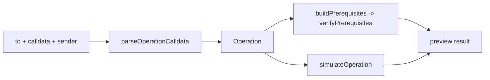

# Preview

Tools for **previewing a Gearbox operation before it is sent on-chain**: turn raw
transaction calldata into a typed, human-readable operation, check the conditions
the sender must satisfy for it to succeed, and simulate it to recover the actual
token movements (or the revert reason).

## Concepts

An **operation** is a transaction performed on behalf of a Gearbox protocol user:

- a **pool user** (liquidity provider) depositing into or redeeming from a pool, or
- a **credit account user** (borrower / liquidator) acting through a credit facade.

Given only `{ to, calldata, sender }`, this module answers three questions:

1. **What is this operation?** (`parse`)
2. **Can the sender execute it, and what must they fix first?** (`prerequisites`)
3. **What would actually happen if it ran right now?** (`simulate`)

All reads use the already-attached `OnchainSDK` (chain, RPC and block are baked in
at attach time). The SDK must be created with the adapters plugin so that adapter
contracts resolve during multicall classification.

## Components

### `parse`

Decodes raw calldata into a typed [`Operation`](./parse/types.ts).

- [`parseOperationCalldata`](./parse/parseOperationCalldata.ts) is the entry point.
  It resolves the contract at `to` and routes:
  - a pool target -> [`parsePoolOperationCalldata`](./parse/parsePoolOperationCalldata.ts)
    (`deposit` / `depositWithReferral` / `redeem`);
  - a credit-facade target -> [`parseFacadeOperationCalldata`](./parse/parseFacadeOperationCalldata.ts)
    (`multicall`, `botMulticall`, `openCreditAccount`, `closeCreditAccount`,
    liquidations), with inner calls classified by
    [`classifyInnerOperations`](./parse/classifyInnerOperations.ts);
  - anything else throws `UnsupportedTargetError`.
- `Operation = PoolOperation | OuterFacadeOperation`. Use `isPoolOperation` to
  narrow. The parse stage is calldata-only: fields knowable only on-chain (e.g.
  `transfers`, mined `txHash`/`timestamp`, the assigned credit account address)
  are left empty and filled in later by simulation.

### `prerequisites`

The on-chain conditions the **sender can fix themselves** before retrying.

- [`buildPrerequisites`](./prerequisites/buildPrerequisites.ts) derives the
  prerequisites for an `Operation` (token allowances and balances for deposits,
  redeems, collateral, partial liquidation).
- [`verifyPrerequisites`](./prerequisites/runPrerequisites.ts) checks them all in a
  single resilient `multicall` (`allowFailure: true`); each prerequisite resolves
  its own slice into an `AnyPrerequisiteResult` (`satisfied` or `error`).

Only **sender-actionable** conditions belong here (approve a token, top up a
balance). Non-actionable protocol/admin state (pool pause, available liquidity,
health factor, bot permissions, degen NFT gating) is intentionally out of scope.

### `simulate`

Runs the call against real chain state to recover what actually happens.

- [`simulateOperation`](./simulate/simulateOperation.ts) is the entry point. It
  routes by operation kind:
  - pool operations -> [`simulatePoolOperation`](./simulate/simulatePoolOperation.ts),
    which sandwiches the raw calldata between `balanceOf` reads to compute balance
    changes and extracts wallet-relevant ERC-20 transfers;
  - credit-facade operations -> [`simulateFacadeOperation`](./simulate/simulateFacadeOperation.ts)
    (currently a stub that throws `"not yet implemented"`).
- On success it returns `{ transfers, balanceChanges, gasUsed }`; on revert it
  returns a decoded reason via
  [`decodeSimulationError`](./simulate/decodeSimulationError.ts). Because there are
  no state overrides, an unmet prerequisite surfaces here as a simulation failure.

## Intended usage

```ts
import {
  parseOperationCalldata,
  buildPrerequisites,
  verifyPrerequisites,
  simulateOperation,
} from "@gearbox-protocol/sdk/preview";

// 1. Parse raw calldata into a typed operation.
const operation = parseOperationCalldata({ sdk, to, calldata, sender });

// 2. Check sender-actionable prerequisites (allowances, balances).
const prereqs = buildPrerequisites(operation, { sdk, wallet: sender });
const prereqResults = await verifyPrerequisites(prereqs, { sdk, wallet: sender });

// 3. Simulate to recover transfers / balance changes (or the revert reason).
const sim = await simulateOperation({ sdk, operation, to, calldata, wallet: sender });
```


